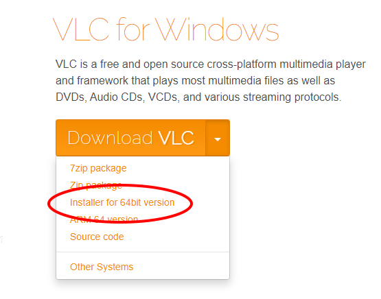

# Rollback Music Alternative

Our God Fizzi created, Rollback Netcode for the beloved GameCube game 'Super Smash Bros. Melee'.
However, with all the greatness that came there was one small flaw which was NO-MUSIC.

Sadly, many people miss the Dreamland chants!

There is a solution however it is not the most optimal.
What RollbackMusicAlt does is it detects what stage you're playing on, and then plays the respected songs for that stage.

P.S. this was my first time coding in Python and was the project that I used to learn the language

## Getting Started

## Installing

### Prerequisites
Make sure you have the following installed:

**Install** [VLC - 64 bit](https://www.videolan.org/vlc/download-windows.html) inside 'C:\Program Files\VideoLAN\VLC'

**Install** [Tesseract-OCR](https://tesseract-ocr.github.io/tessdoc/4.0-with-LSTM.html#400-alpha-for-windows) inside 'C:\Program Files (x86)\Tesseract-OCR\'

**Install** [Python - 64 bit](https://www.python.org/downloads/windows/)

### Download

You can download V1.0 here: [RollbackMusicAlt](https://github.com/Carr-23/RollbackMusicAlt/releases/tag/1.0)

## Built With

* [getPass](https://docs.python.org/3/library/getpass.html)        - Used to get current Windows 10 user
* [OpenCV](https://pypi.org/project/opencv-python/)                    - Used to edit the screenshot
* [keyboard](https://pypi.org/project/keyboard/)          - Used to get user input
* [pyautogui](https://pypi.org/project/PyAutoGUI/)         - Used to screenshot
* [pytesseract](https://pypi.org/project/pytesseract/)       - Used to convert the image to text (OCR)
* [fast_youtube_search](https://pypi.org/project/fast-youtube-search/)       - Used to get YouTube search results
* [os](https://pythonprogramming.net/python-3-os-module/)       - Used to manage files
* [pafy](https://pypi.org/project/pafy/)       - Used to download YouTube Videos
* [vlc](https://pypi.org/project/python-vlc/)       - Used to run Music
* [tkinter](https://tkdocs.com/tutorial/install.html)       - Used to create the user interface
* [numpy](https://pypi.org/project/numpy/)       - Used for OCR image processing
* [youtube-dl](https://pypi.org/project/youtube_dl/) - Used as a part of pafy
* [Pillow](https://pypi.org/project/Pillow/2.2.2/) - Used to read pixel data

## Versioning

* 0.1 -> Launch

## Authors

* **Braulio Carrion Corveira** - *Future Computer Engineer* - Outdated Site: https://carr-23.github.io/

## Future Builds
- Better UI with a custom look
- Drag and drop URL's
- Fix lag when changing input key
- Fix issue of no music playing even if detected (no idea how to fix as of now)
- RollbackMusicAlt Lite, which would include only the automated process

## Looking To Help Out?

The main things I would need help with is optimizing the code, and creating a better User interface.
You can contact me on my throwaway email: gone.pokemon@gmail.com

## Acknowledgments

* Go support Fizzi at https://slippi.gg/
* After Supporting Fizzi, if you still want to support me you can do so at https://paypal.me/brauliocarr

